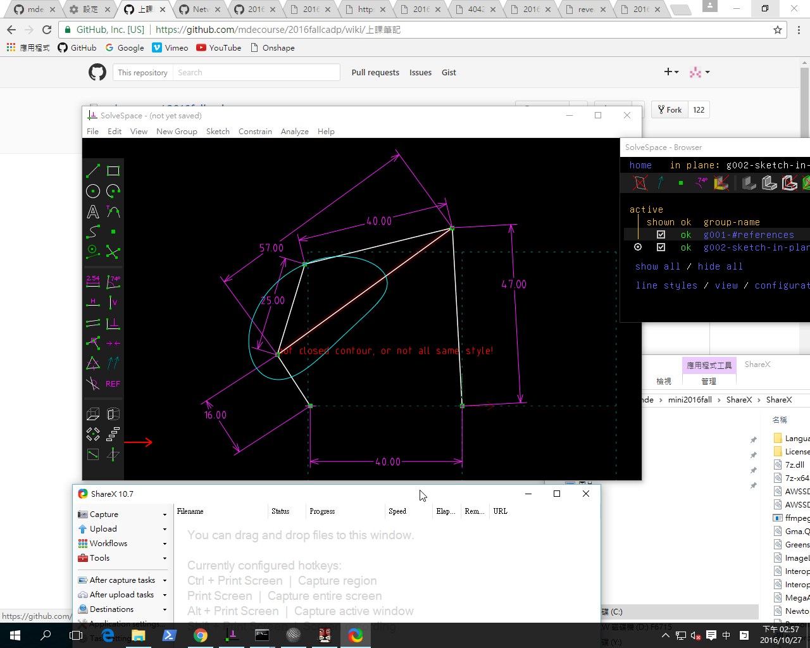

Title: 2016Fall w7 四連桿機構模擬
Date: 2016-10-27 12:00
Category: Misc
Tags: fourbar
Author: yen

已經四連桿各桿尺寸, 當機構繞行一圈後求特定點的座標, 以 Solvespace 進行點座標追蹤存檔, 得到 <a href="./../w7/w7_fourbar.csv">w7_fourbar.csv</a>, 根據下圖, 試驗證 Solvespace 機構模擬的資料之正確性.

<!-- PELICAN_END_SUMMARY -->

Solvespace 四連桿圖檔:

<a href="./../w7/w7_fourbar.slvs">w7_fourbar.slvs</a> (請以滑鼠右鍵存檔)

參考: <a href="http://mechanicalexpressions.com/explore/kinematics/4-bar-linkage.html">http://mechanicalexpressions.com/explore/kinematics/4-bar-linkage.html</a>

